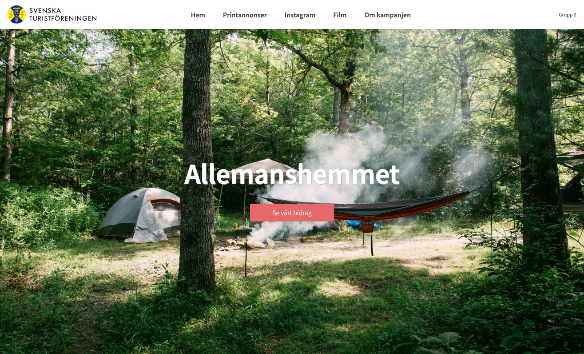

# Campaign site for Svenska Turistföreningen



This is a website showing our campaign idea that was created during Yrgo's competition Sammanslaget. We had 76 hours to come up with a campaign idea and execute it. My job was to code a website where we could show information about the campaign.

## Link 

https://allemanshemmet.netlify.app/

## Installation
- Clone the repository
```
$ git clone https://github.com/majaalin/sammanslaget
```
- In the project directory, run: 
- Start a local server
```
$ npm start
```
- This runs the app in the development mode. Open http://localhost:3000 to view it in the browser.

## License
This project is licensed under the MIT License.